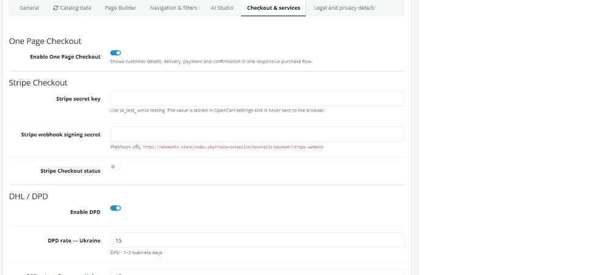
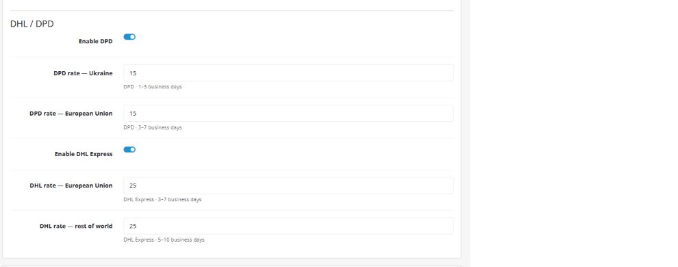

# Настройка доставки и Stripe для 6 Moments

Актуально для NOVERAILE Commerce Suite и OpenCart 4.1.0.3 на `6moments.store`.

## Где находятся настройки

1. Откройте админку: `https://6moments.store/saymynameadmin/`.
2. Перейдите в **Extensions → Extensions**.
3. В типе расширений выберите **Modules** и откройте **NOVERAILE Commerce Suite**.
4. Откройте вкладку **Checkout & services**.
5. После изменений нажмите **Save** в верхней части страницы.

## Stripe Checkout

### 1. Подготовка Stripe

Перед приемом реальных платежей аккаунт Stripe должен быть активирован: заполнены данные бизнеса, подтверждена личность владельца и добавлен банковский счет для выплат.

Сначала рекомендуется настроить sandbox/test mode:

1. В Stripe Dashboard включите тестовый режим или откройте sandbox.
2. Откройте **Developers / API keys**.
3. Скопируйте **Secret key**, начинающийся с `sk_test_`.
4. Не используйте `pk_test_`: магазину нужен именно серверный Secret key.

### 2. Создание webhook

В Stripe Dashboard откройте **Workbench → Webhooks**. В старом интерфейсе раздел может называться **Developers → Webhooks**.

1. Нажмите **Create an event destination** или **Add destination**.
2. Источник событий: **Account / Your account**, не Connected accounts.
3. Выберите событие `checkout.session.completed`.
4. Тип назначения: **Webhook endpoint**.
5. Укажите URL:

   `https://6moments.store/index.php?route=extension/noveraile/payment/stripe.webhook`

6. Создайте endpoint.
7. Откройте созданный endpoint, раскройте **Signing secret** и скопируйте значение `whsec_...`.

Webhook secret относится к конкретному endpoint. Для тестового и рабочего режимов Stripe используются разные значения `whsec_...`.

### 3. Заполнение админки

На вкладке **Checkout & services** заполните:

- **Stripe secret key** — `sk_test_...` для тестирования или `sk_live_...` для реальных платежей;
- **Stripe webhook signing secret** — `whsec_...` созданного endpoint;
- **Stripe Checkout status** — включить.

Нажмите **Save**. После сохранения поля с ключами визуально очищаются: это нормально. При последующих изменениях доставки оставляйте их пустыми — сохраненные ключи останутся без изменений.

### 4. Проверка в тестовом режиме

1. Добавьте товар в корзину и полностью заполните адрес доставки.
2. Выберите Stripe и перейдите к оплате.
3. Используйте тестовую карту `4242 4242 4242 4242`, любую будущую дату и любой трехзначный CVC.
4. После успешной оплаты проверьте:

   - Stripe Dashboard → **Payments** — платеж имеет статус успешного;
   - Stripe → **Workbench → Webhooks → Event deliveries** — событие `checkout.session.completed` получило ответ `2xx`;
   - OpenCart → **Sales → Orders** — заказ создан, а после webhook переведен в статус обработки.

Для проверки отклоненного платежа можно использовать тестовую карту `4000 0000 0000 0002`.

### 5. Переключение на реальные платежи

1. Активируйте live mode в Stripe.
2. Получите live Secret key `sk_live_...`.
3. Создайте отдельный live webhook с тем же URL и событием `checkout.session.completed`.
4. Скопируйте live Signing secret `whsec_...`.
5. Замените оба значения в админке и сохраните.
6. Проведите один небольшой реальный заказ, проверьте заказ и webhook, затем при необходимости сделайте возврат через Stripe Dashboard.

Никому не отправляйте `sk_live_...` и `whsec_...` в мессенджерах и не добавляйте их в репозиторий.

## Доставка DHL и DPD

Тарифы вводятся в базовой валюте магазина — сейчас это EUR. Значение `0` означает бесплатную доставку.

### DPD

1. Включите **Enable DPD**.
2. В **DPD rate — Ukraine** укажите стоимость доставки по Украине.
3. В **DPD rate — European Union** укажите стоимость доставки в ЕС.

Покупателю показываются сроки:

- Украина — 1–3 рабочих дня;
- Европейский союз — 3–7 рабочих дней.

### DHL Express

1. Включите **Enable DHL Express**.
2. В **DHL rate — European Union** укажите стоимость доставки в ЕС.
3. В **DHL rate — rest of world** укажите стоимость доставки в остальные страны.

Покупателю показываются сроки:

- Европейский союз — 3–7 рабочих дней;
- остальные страны — 5–10 рабочих дней.

### Какие способы увидит покупатель

| Адрес покупателя | Доступные способы |
|---|---|
| Украина | DPD |
| Страна ЕС | DPD и DHL Express |
| Остальной мир | DHL Express |

Метод доставки появляется только после того, как покупатель введет страну в checkout.

### Проверка тарифов

После сохранения проведите три тестовых оформления без оплаты:

1. Украина — отображается DPD и тариф для Украины.
2. Германия или Чехия — отображаются DPD и DHL с тарифами ЕС.
3. США, Великобритания или Швейцария — отображается DHL с тарифом rest of world.

Проверьте, что доставка добавляется к итоговой сумме заказа и сохраняется в **Sales → Orders**.

## Ограничение текущей доставки

Модули DHL/DPD сейчас выбирают службу по стране и добавляют фиксированный тариф. Они не подключены к API перевозчиков и поэтому автоматически не:

- рассчитывают цену по весу и точному индексу;
- создают накладную;
- вызывают курьера;
- получают трек-номер;
- передают статус перевозки в заказ.

Для автоматических накладных и трекинга понадобится отдельная интеграция с API и договор/учетная запись DHL или DPD.

## Официальные материалы Stripe

- [API keys](https://docs.stripe.com/keys)
- [Создание webhook endpoint](https://docs.stripe.com/development/dashboard/webhooks)
- [Webhook и обработка Checkout](https://docs.stripe.com/checkout/fulfillment)
- [Тестовые карты](https://docs.stripe.com/testing)
